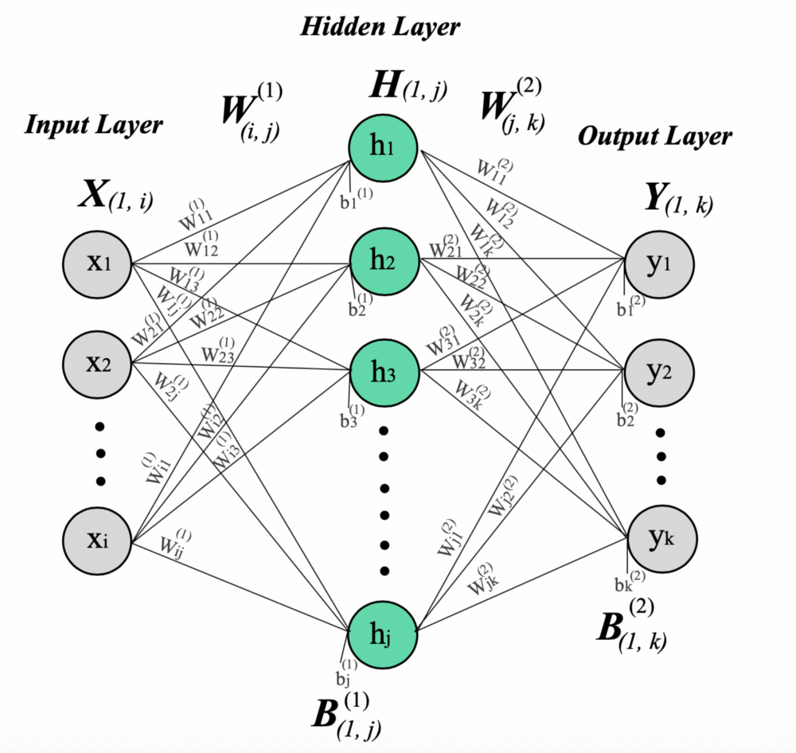

# Digit Recognition Using Neural Network Built From Scratch

In this assignment, you will build a complete neural network using Numpy. You will implement all the steps required to build a network - feedforward, loss computation, backpropagation, weight updates etc.

You will use the MNIST dataset to train your model to classify handwritten digits between 0-9.

